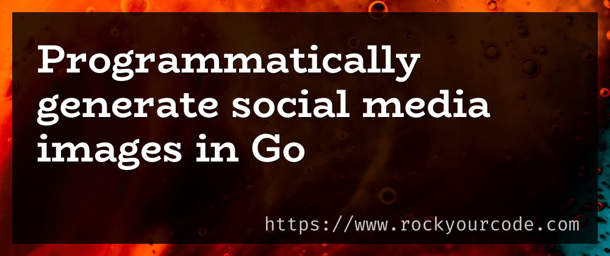

# go-generate-social-banners

**go-generate-social-banners** is a Go program that automatically generates social media images.

The project applies the idea from these two blog posts:

- [Programatically generate gorgeous social media images in Go](https://pace.dev/blog/2020/03/02/dynamically-generate-social-images-in-golang-by-mat-ryer.html)
- [Writing Go CLIs With Just Enough Architecture](https://blog.carlmjohnson.net/post/2020/go-cli-how-to-and-advice/)

## Installation

1. You need [Go](https://golang.org/dl/) on your machine. Then clone the repository:

   ```sh
   git clone https://github.com/sophiabrandt/go-generate-social-banners.git
   ```

2. Build binary:

   ```sh
   cd go-generate-social-banners
   go build -o go-generate-social-banners
   ```

## Usage

```sh
./go-generate-social-banners -h

>
Usage of go-generate-social-banners:
-d string
      Default Text (domain name) (default "https://rockyourcode.com")
-i string
      Path to background image to generate banner from (default "./background.jpg")
-o string
      Full path of the image to generate (default "./social-media-banner.png")
-t string
      Title (default "Programmatically generate social media images in Go")
```

Example image (1000x420px):



## Contributing

Pull requests are welcome. For major changes, please open an issue first to discuss what you would like to change.

Please make sure to update tests as appropriate.

## License

[MIT](https://choosealicense.com/licenses/mit/)
